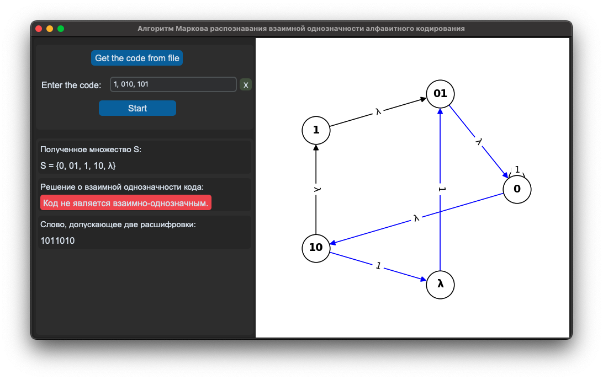
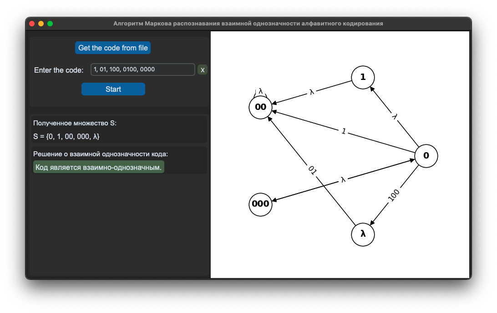

## Дипломная работа - Алгоритм Маркова для распознавания взаимной однозначности алфавитного кодирования

### Описание проекта

Это приложение реализует алгоритм Ал.А. Маркова для проверки взаимной однозначности алфавитного кодирования. Программа анализирует введенный код, строит соответствующий граф и определяет, является ли код взаимно-однозначным. Визуализация графа помогает понять структуру кода и наличие потенциальных проблем.

### Основные возможности

- Проверка кода на взаимную однозначность
- Визуализация графа кода с выделением циклов
- Генерация примера слова с неоднозначным декодированием (если код не взаимно-однозначен)
- Возможность ввода кода вручную или загрузки из файла
- Кроссплатформенность (работает на Windows и macOS)

### Пример работы

